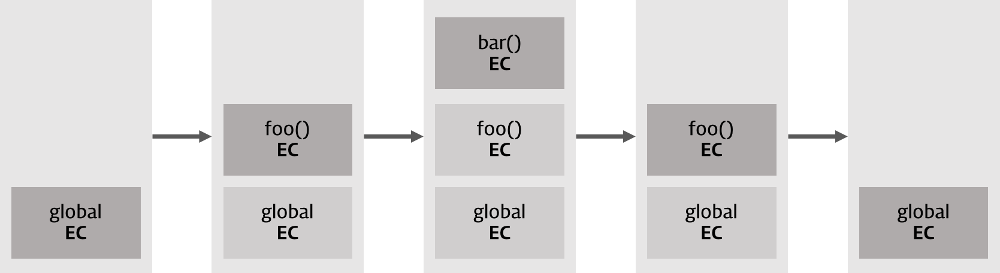

context = 문맥, 맥락

실행의 맥락(흐름)을 파악할 수 있는 실행 컨텍스트~

---

<aside>
🏗️ 간단하게 말하면.. 실행 컨텍스트는!

1. 식별자(변수)를 관리하는 **스코프** 관리한다(`렉시컬 환경`)
2. 실행 컨텍스트가 생성되면 코드의 **실행 순서**는 관리된다(`실행 컨텍스트 스택`)
   
   </aside>

# 실행 컨텍스트

자바스크립트의 **동작 원리**를 담고 있는 핵심 개념

실행컨텍스트를 이해하면?

- **스코프**를 기반으로 식별자와 식별자에 바인딩된 값을 관리하는 방식
- **호이스팅**이 발생하는 이유
- **클로저** 동작 방식
- 태스크 큐와 함께 동작하는 **이벤트 핸들러**
- **비동기 처리**의 동작방식

이렇게 많은 일들을 이해할 수 있다고 하니.. **이해합시다!**

## 소스코드의 타입

**ECMAScript**(ECMA-262 기술 규격에 따라 정의하고 있는 **표준화된 스크립트 프로그래밍 언어**)에서는 소스코드를 **4가지**로 분류한다.

이 4가지 타입의 소스코드는 실행 컨텍스트를 생성한다. 왜 이 4개로 나누었냐면! 소스코드의 타입에 따라 실행 컨텍스트를 **생성하는 과정과 관리하는 내용이 다르기 때문**

1. **전역 코드**
   
   - 전역에 존재하는 소스코드(함수, 클래스 X)
   - 전역 코드 평가 후 전역 실행 컨텍스트 생성됨
   1. 최상위 **스코프**(전역 스코프) 생성
   2. var 키워드로 선언된 전역 **변수**와 함수 선언문으로 정의된 전역 **함수**를
   3. **전역 객체의 프로퍼티와 메서드로 바인딩하고 참조**하기 위해 **전역객체와 연결**

2. **함수 코드**
   
   - 함수 내부에 존재하는 소스 코드(중첩된 함수, 클래스X)
   - 함수 코드가 평가되면 함수 실행 컨텍스트 생성된다.
   1. 지역 **스코프**를 생성
   2. 지역 변수, 매개변수, arguments 객체를 **관리**
   3. 생성한 지역 스코프를 전역 스코프에서 시작하는 **스코프 체인의 일원**으로 **연결**
   
   ---

3. **eval 코드([공식적으로 쓰지말라고 들었는뎅?](https://developer.mozilla.org/ko/docs/Web/JavaScript/Reference/Global_Objects/eval#eval%EC%9D%84%20%EC%A0%88%EB%8C%80%20%EC%82%AC%EC%9A%A9%ED%95%98%EC%A7%80%20%EB%A7%90%20%EA%B2%83!))**
   
   - 전역함수 eval에 인수로 전달되어 실행되는 소스코드
   
   - eval 코드가 평가되면 eval 실행 컨텍스트 생성
   1. strict mode(엄격 모드)에서 자신만의 독자적인 스코프를 생성

4. **모듈 코드**
   
   - 모듈 내 존재하는 소스코드(내부의 함수, 클래스X)
   
   - 모듈 코드가 평가되면 모듈 실행 컨텍스트가 생성
   1. 모듈별로 독립적인 모듈 스코프 생성

## 소스코드의 평가와 실행

위의 소스코드 4개는 모두 1. 평가과정을 거친 후 2. 소스코드를 실행한다

- ex)
  
  ```jsx
  var x;    // 평가과정에서 실행, x는 실행 컨텍스트가 관리하는 스코프(렉시컬 환경의 환경 레코드)에 등록,
            // undefined로 초기화
  
  x = 10;   // 실행 과정에서는 위의 문장 실행x(이미 실행됐음), 현 문장만 실행
            // x에 10을 할당할 건데, 선언된 변수인지 확인을 해야겠죠?
            // 실행 컨텍스트가 관리하는 스코프에 x가 있는지 확인(=선언된 변수인가?)
            // 선언된 변수라면 값을 할당하고, 할당 결과를 실행 컨텍스트에 등록하여 관리
  ```

- **평가 과정**
  
  1. 실행 컨텍스트 생성
  2. 변수, 함수 등 선언문만 먼저 실행
  3. 생성된 변수나 함수 식별자를 키key로 실행 컨텍스트가 관리하는 스코프(렉시컬 환경의 환경 레코드)에 등록

- **실행 과정**
  
  1. 런타임의 시작!
  2. 소스 코드 실행에 필요한 정보(변수, 함수의 참조)를 실행 컨텍스트가 관리하는 스코프에서 검색 후 취득
  3. 소스코드의 실행 결과(변수 값의 변경 등)는 다시 실행 컨텍스트가 관리하는 스코프에 등록됨.

## 실행 컨텍스트의 역할

```jsx
// 전역 변수 선언
const x = 1;
const y = 2;

// 함수 정의(함수 선언문)
function foo(a){
    // 지역 변수 선언    
    const x = 10;
    const y = 20;

    // 메서드 호출
    console.log(a+x+y);
}

// 함수 호출
foo(100);

// 메서드 호출
console.log(x+y);
```

### 1. 전역 코드 평가

- 코드를 실행하기 전, 평가를 진행(선언문만 실행함)
  
  → 전역코드의 변수 선언문과 함수 선언문이 실행된다.
  
  → **전역 변수(var 키워드)**와 **전역 함수**가 실행 컨텍스트가 관리하는 **전역 스코프**에 등록됨 (== 전역 객체의 프로퍼티와 메서드가 됨)

### 2. 전역 코드 실행

- 런타임 시작, 전역 코드가 순차적으로 실행된다
- 전역 변수에 값이 할당되고 함수가 호출됨
- 함수가 호출되면 전역 코드의 실행을 일시중단, 함수 내부로 진입한다

### 3. 함수 코드 평가

- 함수 코드 평가 과정을 거친다(선언문들을 실행)
  
  → 매개변수와 지역 변수 선언문이 실행, 그 결과 생성된 **매개변수**와 **지역변수**가 실행 컨텍스트가 관리하는 **지역 스코프**에 등록

- **arguments 객체** 생성, 지역스코프에 등록(18장 함수와 일급객체 읽어보세용💕)

- **this 바인딩** 결정

### 4. 함수 코드 실행

- 런타임 시작, 함수 코드 순차적으로 실행
- 매개변수와 지역 변수에 값이 할당됨, 메서드 실행(`console.log`)
  - 식별자 console을 스코프체인을 이용해서 검색한다, == 지역 스코프는 전역 스코프와 연결된다.
  - 하지만 console은 전역 스코프에도 없고, 전역 객체의 프로퍼티에 존재한다!(더 상위)
  - 이 말은, **전역 스코프를 통해 전역 객체의 프로퍼티에 접근할 수 있다는 뜻이다**
- 다음은 console 객체의 프로토타입 체인을 통해 log 프로퍼티 검색
- 그 후 console.log 메서드에 인수로 전달된 표현식 a+x+y를 평가(a, x, y는 스코프 체인을 통해 검색)
  - console.log 메서드의 실행이 종료되면 함수 코드의 실행 종료, 전역 코드의 실행을 계속한다.

---

우리가 이 과정을 통해 알게된 것!

- 코드가 실행되려면 스코프를 구분하여 식별자와 바인딩된 값이 관리되어야 한다(상태 변화를 지속적으로 관리)
- **스코프체인**을 형성하여 식별자를 검색할 수 있어야 한다(상위 스코프로 이동하며 식별자를 검색)
- 전역 객체의 프로퍼티도 전역 변수처럼 검색할 수 있어야 한다(console)
- 함수가 종료되면, 함수가 호출되기 이전으로 돌아간다(실행 컨텍스트 스택)

이 모든 것을 관리하는 것이 바로 **실행 컨텍스트**

실행 컨텍스트는 **식별자를 등록하고 관리하는 스코프**와 **실행 순서 관리를 구현한 내부 메커니즘**, 모든 코드는 실행 컨텍스트를 통해 실행되고 관리된다‼️

## 실행 컨텍스트 스택(실행 순서 관리)

자바스크립트 엔진은 전역 코드를 평가하고 전역 실행 컨텍스트를 생성한다. 런타임 실행하다가 함수가 나오면 전역 코드의 실행을 중단하고, 함수 내부로 들어간다.

함수 코드를 평가하고 함수 실행 컨텍스트를 생성한다…

이때 생성된 실행 컨텍스트는 스택 구조로 관리된다**(LIFO)**



**실행 컨텍스트(EC, Excution Context)가 생성되면 실행 컨텍스트 스택에 푸시된다.**

중간에 함수가 있으면 함수 코드 평가 후 함수 실행 컨텍스트를 생성하고 스택에 푸시push한다….

함수가 종료되면, 자바스크립트 엔진은 실행 컨텍스트 스택에서 해당 함수 EC를 팝pop한다….의 과정 반복.

⇒ 스택의 최상위 실행 컨텍스트는 현재 실행중인 코드의 것이다! == **실행 중인 실행 컨텍스트**

## 렉시컬 환경(식별자를 등록하고 관리하는 스코프)

**렉시컬 환경**

- 식별자와 식별자에 **바인딩된 값**, **상위 스코프에 대한 참조**를 기록하는 자료구조
- **key**(식별자), **value**(식별자에 바인딩된 값)를 갖는 **객체 형태의 스코프**scope 생성

---

**실행 컨텍스트**는 두 가지 컴포넌트로 구성된다

1. Lexical Environment 컴포넌트
2. Variable Environment 컴포넌트

얘네들은 생성 **초기에는 동일한 렉시컬 환경**을 참조한다.

이후 몇 가지 상황을 만나면 Variable Environment 컴포넌트를 위한 새로운 렉시컬 환경을 생성하면서 이 두 컴포넌트의 내용이 달라지는 경우도 있다…

아직 뭔소린지 몰라도돼!

**렉시컬 환경**은 두 가지 컴포넌트로 구성된다

1. **Environment Record** `환경 레코드`
   
   스코프에 포함된 식별자를 등록하고 등록된 식별자에 바인딩된 값을 관리하는 저장소
   
   소스코드의 타입에 따라 관리하는 내용에 차이가 있다.

2. **Outer Lexical Environment Reference** `외부 렉시컬 환경에 대한 참조`
   
   상위 스코프를 가리킨다(== 해당 실행 컨텍스트를 생성한 소스코드를 포함하는 상위 코드의 렉시컬 환경)
   
   **단방향 링크드 리스트**인 스코프 체인을 구현함

## 실행 컨텍스트의 생성과 식별자 검색 과정

```jsx
var x=1;
const y=2;

function foo(a){
    var x=3;
    const y=4;

    function bar(b){
        const z=5;
        console.log(a+b+x+y+z);
    }
    bar(10);
}

foo(20);  // 42
```

일단 이 코드의 실행 결과는 42입니다~ 어떻게 42가 나오는지, 한 번 알아봅시다~

### 1. 전역 객체 생성

**전역 객체는 전역 코드가 평가되기 이전에 생성**된다.

전역 객체의 자세한 내용은 21장 21.4 전역객체를 보시면 되는데~ 간단하게 말하면 어떤 객체에도 속하지 않는 최상위 객체임!

전역 객체는 표준 빌트인 객체(Object, Number, Array 등), 환경에 따른 호스트 객체, 전역 변수와 전역 함수를 프로퍼티를 가짐…

어쨌든 우선 전역 객체부터 생성된다.

### 2. 전역 코드 평가

<aside>
🌻 이 순서대로 코드 평가가 진행됨!

1. 전역 실행 컨텍스트 생성

2. 전역 렉시컬 환경 생성
   
   1. 전역 환경 레코드 생성
      1. 객체 환경 레코드 생성
      2. 선언적 환경 레코드 생성
   2. this 바인딩
   3. 외부 렉시컬 환경에 대한 참조 결정

----

1. **전역 실행 컨텍스트 생성**
   
   전역 실행 컨텍스트를 생성하고, 실행 컨텍스트 스택에 푸시한다.

2. **전역 렉시컬 환경 생성**
   
   전역 렉시컬 환경을 생성하고 전역 실행 컨텍스트에 바인딩!
   
   렉시컬 환경은 환경 레코드와 외부 렉시컬 환경에 대한 참조로 구성되어 있다. 각각 생성함
   
   1. **전역 환경 레코드 생성**
      
      전역 변수를 관리하는 전역 스코프, 전역 객체의 빌트인 전역 프로퍼티와 빌트인 전역 함수, 표준 빌트인 객체를 제공
      
      `var 키워드`로 선언한 전역 변수와 `let, const 키워드`로 선언한 전역 변수를 **구분하여 관리**하기 위해! 전역 환경 레코드를 **둘로 나누었다**.
      
      이 둘은 서로 협력하여 전역 스코프와 전역 객체(정확히는 전역 변수의 전역 객체의 프로퍼티화)를 관리한다
      
      1. **객체 환경 레코드 생성**
      
      **BindingObject**라고 부르는 객체와 연결된다.(전역 객체 생성때 같이 생성됨)
      
      `var 키워드`로 선언된 전역 변수와 전역 함수는 BindingObject를 통해 **전역 객체의 프로퍼티와 메서드**가 된다.
      
      이 때, 전역 객체에 변수 식별자를 키로 등록한 다음 undefined를 바인딩한다. ⇒ 변수 호이스팅이 발생!
      
      함수 선언문도 마찬가지다.
      
      2. **선언적 환경 레코드 생성**
      
      `let, const 키워드`로 선언된 전역변수는 이곳에 등록되고 관리된다. == **전역 객체의 프로퍼티가 되지 않는다**
      
      선언 단계와 초기화 단계가 분리되어 진행된다 ⇒ 변수 호이스팅 자체는 존재하지만, 초기화를 하지 않았기 때문에 참조할 수 없음, ReferenceError
   
   2. **this 바인딩**
      
      전역 환경 레코드의 [[GlobalThisValue]] 내부 슬롯에 this가 바인딩된다.
      
      일반적으로 전역 코드에서 this는 전역 객체를 뜻하므로 전역 객체가 바인딩된다.
   
   3. **외부 렉시컬 환경에 대한 참조 결정**
      
      외부 렉시컬 환경에 대한 참조는 상위 스코프를 가리킨다, 단방향 링크드 리스트(하위→상위로만 검색 가능)
      
      현재는 전역 코드를 평가중이므로 전역 코드를 포함하는 상위 코드는 존재하지 않기 때문에 외부 렉시컬 환경에 대한 참조는 null이 할당된다.
      ⇒ 전역 렉시컬 환경이 스코프 체인의 종점임을 뜻한다.

### 3. 전역 코드 실행

이제 전역 코드가 순차적으로 실행된다. 변수 할당문이 실행되어 전역 변수에 값이 할당된다.

변수 할당문/함수 호출문을 실행하려면, 먼저 이것들이 선언된 식별자인지 확인해야 한다. 선언되지 않았으면 참조할 수 없기 때문이다.

- **식별자 결정**
  
  식별자는 스코프가 다르면 동일한 이름이어도 문제가 없다! 따라서 어느 스코프의 식별자인지 구분해내야 한다 **= 식별자 결정**
  
  보통은, **현재 실행중인 컨텍스트의** **렉시컬 환경의 환경 레코드**에서 식별자를 검색한다.
  검색할 수 없다면, 렉시컬 환경의 **외부 렉시컬 환경에 대한 참조가 가리키는 렉시컬 환경**(== **상위 스코프**)에서 식별자를 검색한다.
  
  이것이 바로 **스코프 체인의 동작 원리**!
  
  현재는 전역 코드에서 실행중이므로, 만약 식별자가 없다면 상위 스코프로 가야하는데 전역 렉시컬 환경은 스코프 체인의 종점이다!
  
  이럴땐 식별자 결정에 실패했기 때문에 참조 에러가 발생한다.

각설, 현재 전역 코드 상황은 값을 할당하고, `foo함수를 호출`하려고 한다.

foo함수가 호출되면

1. 전역 코드의 실행을 일시 중단
2. foo 함수 내부로 코드의 제어권이 이동한다
3. 함수 코드를 평가한다.

### 4. foo 함수 코드 평가

> 🌻 함수 컨텍스트도… 전역 컨텍스트랑 비슷해유~
> 
> 1. 함수 실행 컨텍스트 생성
> 
> 2. 함수 렉시컬 환경 생성
>    
>    1. 함수 환경 레코드 생성
>    2. this 바인딩
>    3. 외부 렉시컬 환경에 대한 참조 결정

1. **함수 실행 컨텍스트 생성**
   
   함수 실행 컨텍스트는 렉시컬 환경이 완성된 **다음 실행 컨텍스트 스택에 푸시된다**. 그말은 즉슨, 아직 실행중인 컨텍스트는 전역 컨텍스트라는 뜻

2. 함수 **렉시컬 환경 생성**
   
   함수 렉시컬 환경을 생성하고 함수 실행 컨텍스트에 바인딩!
   
   1. **함수 환경 레코드 생성**
      
      **매개변수**, **arguments 객체**, 함수 내부에 선언한 **지역 변수**와 **중첩 함수**를 등록하고 관리한다.
   
   2. **this 바인딩**
      
      함수 환경 레코드의 [[ThisValue]] 내부 슬롯에 this가 바인딩된다.
      
      this에 바인딩될 객체는 함수 호출 방식에 따라 달라진다.
      
      foo 함수는 일반 함수이므로 this는 전역 객체를 가리킨다.
   
   3. **외부 렉시컬 환경에 대한 참조 결정**
      
      foo함수 정의가 **평가된 시점에서 실행중인 실행 컨텍스트의 렉시컬 환경의 참조**가 할당된다
      
      따라서, 함수의 상위 스코프는 나를 호출한 곳이 아니라 내가 선언된 곳에 따라 결정된다.
      
      이 함수의 상위 스코프는 함수 객체의 내부 슬롯 [[Environment]]에도 저장된다.
      
      따라서 함수 객체의 내부 슬롯 [[Environment]]에 저장된 렉시컬 환경의 참조 == 함수 렉시컬 환경의 외부 렉시컬 환경에 대한 참조
      
      (이걸 알아야 클로저를 이해할 수 있대요… 일단 알아둡시다! 둘은 같은거다!)

### 5. foo 함수 코드 실행

함수가 순차적으로 실행되어 매개변수에 인수가 할당되고, 변수 할당문이 실행되어 지역변수에 값이 할당된다. 그리고 함수 bar가 호출된다.

이때, 지역변수의 식별자 할당을 위해 실행중인 실행 컨텍스트의 렉시컬 환경에서 식별자 검색을 시작한다. 만약 검색할 수 없으면, 외부 렉시컬 환경에 대한 참조가 가리키는 렉시컬 환경(상위 스코프)로 이동하여 식별자를 검색한다. 검색된 식별자에 값을 할당한다.

### 6. bar 함수 코드 평가

foo 함수에서 bar 함수를 실행하기 직전!(이 말은, 아직 실행 컨텍스트 스택의 맨 위 객체는 foo함수의 실행 컨텍스트라는 뜻)

과정은 똑같아서……

### 7. bar 함수 코드 실행

코드가 실행되면 매개변수에 인수가 할당되고, 변수 할당문이 실행되어 지역변수에 값이 할당된다.

```jsx
var x=1;
const y=2;

function foo(a){
    var x=3;
    const y=4;

    function bar(b){
        const z=5;
        console.log(a+b+x+y+z);
    }
    bar(10);
}

foo(20);  // 42
```

현재 bar 함수에서, console.log를 실행해야됨!

1. `console` 식별자 검색
   
   console.log 식별자를 스코프 체인에서 검색해야 함.
   
   스코프 체인은 **현재 실행중인 실행 컨텍스트의 렉시컬 환경**~ **외부 렉시컬 환경에 대한 참조**로 이어진다…
   
   따라서 현재의 스코프에서 검색을 시작하여 점점 외부로 나간다.
   
   console 식별자는 현재 스코프에 없으므로, 상위 스코프로 이동한다(foo 함수), foo함수에도 없으므로 foo 함수의 실행 컨텍스트의 외부 렉시컬 환경에 대한 참조가 가리키는 전역 렉시컬 환경으로 이동한다.
   
   console 식별자는 전역 객체의 프로퍼티이고, 전역 렉시컬 환경의 객체 환경 레코드의 BindingObject를 통해 전역 객체에서 찾을 수 있다!

2. `log` 메서드 검색
   
   이제 console 식별자에 바인딩된 log 메서드를 검색한다.(여기서 검색은 프로토타입 체인을 이용한다네요… 잘 몰라서;;)

3. 표현식 `a+b+x+y+z`의 평가
   
   이 표현식을 평가하기 위해 식별자를 검색한다.
   
   검색 순서는 위와 같다.
   
   실행 컨텍스트의 렉시컬 환경 → 외부 렉시컬 환경에 대한 참조 → … → 전역 렉시컬 환경의 객체 환경 레코드(전역 객체)

4. console.log 메서드 호출
   
   표현식 a+b+x+y+z가 평가되어 생성한 값 42를 console.log 메서드에 전달하여 호출

### 8. bar 함수 코드 실행 종료

종료되면 실행 컨텍스트 스택에서 pop, foo실행 컨텍스트가 실행 중인 실행 컨텍스트가 된다.

물론 **렉시컬 환경은 소멸하지 않고** 독립적인 객체로 남아있다, 물론 객체를 포함한 모든 값을 그 누구도 참조하고 있지 않다면 가비지 컬렉터에 의해 메모리 공간에서 해제된다.

### 9. foo 함수 코드 실행 종료

### 10. 전역 코드 실행 종료

<aside>
📌 참조! **실행 컨텍스트와 블록레벨 스코프**

`let, const` 키워드로 선언한 변수는 모든 코드블록(함수, if, for, while, try/catch 등)을 지역 스코프로 인정하는 블록레벨 스코프이다.

```jsx
let x = 1;

if(true){
    let x = 10;
    console.log(x);  //10
}
console.log(x);    //1
```

따라서 블록이 생성될때마다 코드 블록을 위한 블록 레벨 스코프가 생겨야 한다.

이를 위해 **선언적 환경 레코드**를 갖는 **레코드 환경을 새롭게 생성**하여 기존의 전역 렉시컬 환경을 **교체**한다.(실행 컨텍스트 컴포넌트에 LexicalEnvironment가 있었는데, 얘가 참조하는 값이 기존의 전역 렉시컬 환경이 아니라 코드블록을 위한 렉시컬 환경이 되는 것)

그럼 새롭게 생긴 **코드블록을 위한 렉시컬 환경**의 ‘외부 렉시컬 환경에 대한 참조’는? ⇒ if문이 실행되기 이전의 전역 렉시컬 환경

코드 블록의 실행이 종료되면?

다시 기존의 렉시컬 환경으로 되돌린다.

</aside>

# 클로저

MDN에서는 클로저를 이렇게 정의한다.

> 클로저는 함수와 그 함수가 선언된 렉시컬 환경과의 조합이다

렉시컬 환경을 알아야 클로저 함수를 이해할 수 있군요~ 복습합시다.

시간이 읎서서 쵸-스피드 정리

```jsx
const x = 1;

function outer(){
    const x = 10;
    const inner = function(){ console.log(x); };
    return inner();
}

const innerFunc = outer();
innerFunc();
```

- 우리의 생각
  
  1. innerFunc 식별자에는 outer함수 내부의 inner함수가 저장되고, outer함수의 생명주기는 끝난다(= 실행 컨텍스트에서 pop된다.)
  2. outer 함수가 생명주기가 끝나면 그 내부의 변수들도생명주기가 끝날 것이다.
  3. 그럼 inner함수 내부에서 변수 x에 접근할 방법은 없어보인다.

- 힝 속았지?
  
  innerFunc 함수를 실행하면 outer함수가 살아있는 듯 10이 출력된다.

⇒ 외부 함수보다 **중첩 함수가 더 오래 유지**되는 경우 **중첩 함수는 이미 생명 주기가 종료한 외부 함수의 변수를 참조**할 수 있다.

이러한 중첩 함수를 **클로저**라고 한다.

클로저는,

1. 중첩 함수가 **상위 스코프의 식별자를 참조**하고 있다.
2. 중첩 함수가 외부 함수보다 **더 오래 유지**된다.

이 두 가지 조건을 만족하는 함수!
